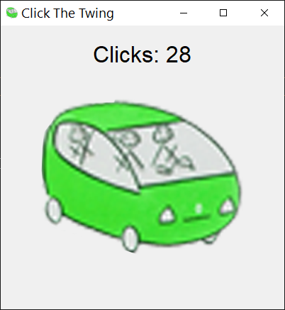

# What is Click The Twing? 

A simple and silly little Twingo clicker game. 
---

[](https://jeevesgb.itch.io/click-the-twingo)


## Features

- Click a button to increase your score.
- Easy to build into a standalone `.exe` for Windows.

---

## Screenshots

  

---

## Requirements

  

- Python 3.8+  
- [Pillow](https://pypi.org/project/Pillow/) library for image support

Install Pillow via pip:

```bash
pip install pillow
```

---

## How to Run

1. Clone or download this repository.
2. Make sure your images (button frames, icon) are in the same folder as `game.py`.
3. Run the game:

```bash
python game.py
```

Or on Windows, double-click the `RunGame.bat`.
---

## 🛠 Building to an EXE


To create a standalone `.exe` file:

1. Install PyInstaller:

```bash
pip install pyinstaller
```

2. Run the provided batch file:

```bash
BuildGame.bat
```

3. Your `.exe` will be in the `dist` folder with the correct icon.

---

## License

This project is open source. Feel free to modify and distribute

---

## Credits

- Bob Ross 
